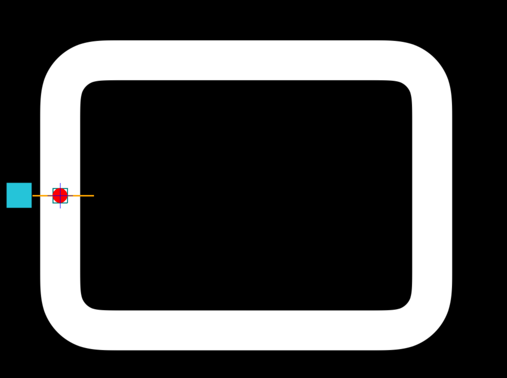

# rl-auto-car

With this project, I want to explore Reinforcement Learning with autonomus driving car via a Pygame Application. Let's Race !



## For Now

Player is controlled via keyboard input to set up all the aspects of the application. In a second time, I want to let the car drive around the track (faster and faster) via Reinforcement Learning procedures.

## Circuit Plan

At first, I had to introduce myself to Pygame; building a race track from a png, playing with a agent (car represented by a ball), etc, ...

## Run the App

In order to launch the app, the 'circuit.py' need to be executed (in a anaconda environment preferably):

```python
(condaenv) python3 circuit.py
```